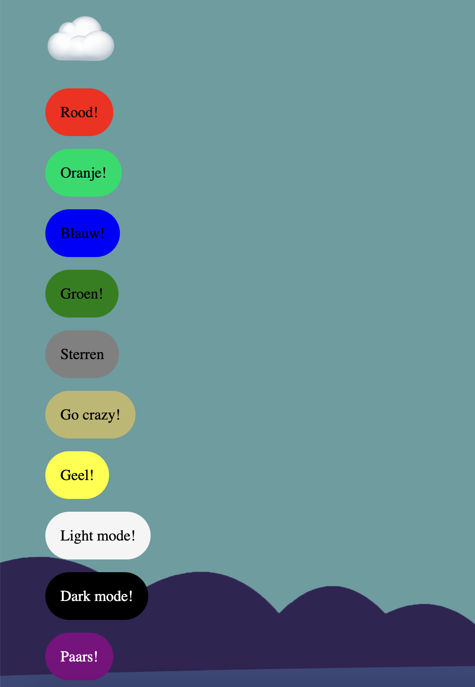
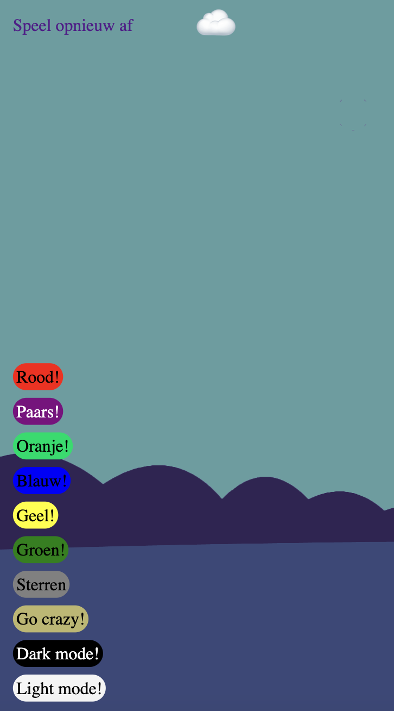
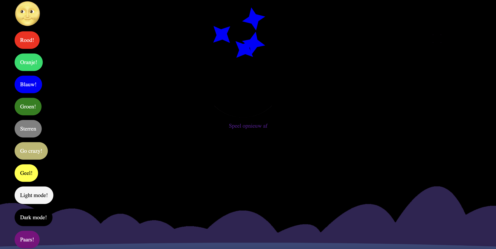

# CSStoTheRescue

## Wat ga ik maken?

Mijn idee is om vuurwerk animaties te gaan maken in combinatie met een control panel.

- Er zijn animaties te zien die altijd afspelen
- De gebruiker kan animaties aan en uit zetten
- De gebruiker kan een thema kiezen
- De gebruiken kan aangeven hoe groot het vuurwerk moet zijn.

## Schets

Hieronder is een schets te zien met alle elementen die ik wil gaan verwerken.


## Week 1

In de eerste week zijn er groepjes gemaakt. Ik heb samen met twee klasgenoten 'mix-blend-mode' onderzocht en uitgewerkt. Deze hebben we voor Nils Binder (gastdocent) en een deel van de klas gepresenteerd. Ik had nog nooit eerder gehoord van deze css term maar deze zal ik misschien later nog in mijn project gaan implementeren.

## Gesprek einde week 1

### Feedback docent

- Idee is prima
- Genoeg elementen om te gaan onderzoeken en te implementeren in het project

## Week 2

Ik heb een begin gemaakt aan de code. Er zijn is nu vuurwerk te zien die automatisch explodeerd. Ook is er een vuurwerk die door de gebruiker handmatig aan- en uitgezet kan worden. Ook heb ik een keyframe gemaakt die een element laat bewegen, mijn idee is om een vuurpijl af te schieten.

### Code

Hoe het ik het vuurwerk gemaakt?
Ik heb een sectie gemaakt met 8 div's erin. Iedere div is een langwerpige balk zodat ze samen een vuurwerk explosie moeten voorstellen.

```html
<label> <input type="checkbox" name="groen" />Groen! </label>

<section>
  <!-- Iedere div een lijn van de explosie -->
  <div></div>
  <div></div>
  <div></div>
  <div></div>
  <div></div>
  <div></div>
  <div></div>
  <div></div>
</section>
```

- De animatie altijd verbergen
- Top en left gebruik ik voor de positie van de animatie
- Transform: scale(1.5) -> Dit gebruik ik voor hoe groot de animatie moet zijn in vergelijking met de standaard animatie (als ik meer vuurwerk gebruik kan ik deze zo makkelijk aanpassen)

```css
section:nth-of-type(1) {
  /* position */
  left: 70%;
  top: 30%;
  /* size */
  transform: scale(1.5);
  display: none;
}

section:nth-of-type(1) div:before {
  animation: firework 2s ease-in-out infinite;
  background-color: green;
}
```

Ik heb een label gemaakt om de animatie aan/uit te kunnen zetten. Door gebruik te maken van de :has selector. Dit om de display te veranderen naar display: block, de sectie moet wel direct na de label staan in de code om deze te selecteren met + te selecteren.

```css
label:nth-of-type(5):has(input[type="checkbox"]:checked)
  + section:nth-of-type(1) {
  display: block;
  animation: moveRight 2s infinite alternate;
}
```

Om de animatie af te laten gaan is natuurlijk een <b>Keyframe</b> nodig. De heb ik ook gemaakt.

```css
@keyframes firework {
  0% {
    top: 100%;
  }
  33%,
  100% {
    top: -75%;
  }
}
```

## Gesprek einde week 2

### Gesprek met de docent

Het idee is duidelijk en een begin is gemaakt. Natuurlijk moet er nog wat meer bij. Ik had het idee om een man te maken die door het scherm komt lopen en dan een pijl afvuurd. Mijn idee is om custom properties te gebruiken en hier tijd op te zetten. Hier heb ik een begin aan gemaakt maar dan met een blokje om het te testen. Eerst komt een blokje van links naar rechts over het scherm, dan gaat de pijl omhoog en vervolgens gaat de explosie af.

### De tijden

```css
:root {
  --walking: 5s;
  --rocket-up: 3s;
  --explode: 3s;
}
```

### de wachttijd van de explosie

```css
section:nth-of-type(4) div:before {
  animation: firework ease-in-out;
  /* animation: firework 5s 1s ease-in-out infinite; */
  background-color: red;
  animation-delay: calc(var(--walking) + var(--rocket-up));
  animation-duration: var(--explode);
}
```

## Week 3

Voor deze week had ik een aantal ideeën die ik wil gaan implementeren in mijn project. Hieronder ga ik stuk voor stuk laten zien wat ik gedaan heb en hoe dit uitziet in de code.

### Achtergrond veranderen (light/dark mode)

Zoals eerder beschreven in mijn project had ik het idee om light/dark mode te gaan gebruiken. Ik heb twee labels gemaakt (checkbox). Ook heb ik een emoji gemaakt die mee veranderd als er op een label geklikt wordt. Ik heb in de css gebruik gemaakt van het <b>:has</b> element. Als het label geselecteerd wordt veranderd de achtergrond kleur (wit of zwart). Als beide geselecteerd zijn wordt de achtergrond grijs en veranderd de emoji in een regenwolkje 🌨️.

```html
<p></p>
<label> <input type="checkbox" name="lightmode" />Light mode! </label>
<label> <input type="checkbox" name="darkmode" />Dark mode! </label>
```

```css
/* Emoji */
p::after {
  /* aanpasbaar */
  content: var(--emoji, "☁️");
}
/* labels */
/* light mode */
body:has(label:nth-of-type(1) input[type="checkbox"]:checked) {
  background-color: white;
  color: black;
  --emoji: "🌞";
}

/* als ze beide gechecked zijn,  */
body:has([name="lightmode"]:checked):has([name="darkmode"]:checked) {
  background-color: grey;
}

body:has([name="lightmode"]:checked):has([name="darkmode"]:checked) p {
  --emoji: "🌨️";
}

/* Dark mode */
body:has(label:nth-of-type(2) input[type="checkbox"]:checked) {
  background-color: black;
  color: white;
  --emoji: "🌝";
}
```

### Pijl toegevoegd

Deze pijl wordt afgeschoten zodra de lopende man de pijl passeerd. Als de pijl boven is dat vervaagd de pijl en vervolgens verdwijnd deze. Dit heb ik in de keyframes toegevoegd. Tot 90% blijft de pijl opacity: 1 en daarna gaat deze vervagen tot bij 100% de opacity: 0 is.


```css
@keyframes move-firework {
  0% {
    translate: 0 0rem;
    opacity: 1;
  }

  90% {
    translate: 0 -28rem;
    opacity: 1;
  }
  100% {
    display: none;
    translate: 0 -28rem;
    opacity: 0;
  }
}
```

### Lopende man toegevoegd (gif)

Deze man komt door het scherm gelopen van links naar rechts en loopt ook uit het scherm. Deze wordt dan niet meer weergegeven d.m.v. <b> overflow: hidden</b>


### Meer explosies toegevoegd

### Ordenen van alle labels (dit was een chaos), ook responsive (mobiel)




### Go crazy button

Ik had het idee om een button te maken die al het vuurwerk af laat gaan. Ik heb een extra label toegevoegd die bovenaan in de code staat. Dit moet omdat ik anders niet alle secties kan selecteren.

```html
<label> <input type="checkbox" name="crazy" />Go crazy! </label>
```

```css
/* als deze aan is gaan alle div's af */
label:nth-of-type(3):has(input[type="checkbox"]:checked) ~ section {
  display: block;
}
```

### Sterren toegevoegd

Mij leek het leuk om als de gebruiker op 'dark mode' klikt om dan een aantal sterren (4 stuks) te laten rondvliegen door het scherm. Ik heb de sterren gemaakt in css en ik heb twee keyframe gemaakt voor het roteren. De bron voor de vorm: https://developer.mozilla.org/en-US/docs/Web/CSS/transform-function/skewX

#### Keyframe voor het roteren

```css
@keyframes rotatingReverse {
  from {
    transform: rotate(0deg);
  }
  to {
    transform: rotate(360deg);
  }
}

@keyframes rotating {
  from {
    transform: rotate(360deg);
  }
  to {
    transform: rotate(0deg);
  }
}
```

#### Vorm van de sterren

```css
article:nth-of-type(4):before,
article:nth-of-type(5):before,
article:nth-of-type(6):before,
article:nth-of-type(7):before {
  content: "";
  position: absolute;
  background: blue;
  width: 1em;
  height: 1em;
  transform: rotate(-45deg) skewX(22.5deg) skewY(22.5deg);
}

article:nth-of-type(4):after,
article:nth-of-type(5):after,
article:nth-of-type(6):after,
article:nth-of-type(7):after {
  content: "";
  position: absolute;
  background: blue;
  width: 1em;
  height: 1em;
  transform: rotate(45deg) skewX(22.5deg) skewY(22.5deg);
}
```

#### Sterrren laten draaien

```css
article:nth-of-type(4),
article:nth-of-type(5),
article:nth-of-type(6),
article:nth-of-type(7) {
  position: absolute;
  margin: 1em auto;
  width: 1em;
  font-size: 2em;

  display: none;
}

article:nth-of-type(4) {
  animation: rotating 5s linear infinite;
  top: 1em;
}

article:nth-of-type(5) {
  animation: rotatingReverse 10s linear infinite;
  top: 2em;
  left: 20em;
}

article:nth-of-type(6) {
  animation: rotatingReverse 3s linear infinite;
  top: 3em;
}

article:nth-of-type(7) {
  animation: rotating 7s linear infinite;
  top: 4em;
}
```



### feedback docent

- eigen vuurwerk (pijl)
- eigen vuurwerk show maken
- css nesting en style queries

## Week 4

Afgelopen weekend opnieuw begonnen

- veel getest
- veel kennis opgedaan de afgelopen weken
- ging er heel snel doorheen
- door veel proberen dit mooie vuurwerk

Aanpasssingen

- zelf bedienen
- titel mee veranderen (kleur en positie (roteer))
- kanon schiet kleurstof af naar de wolk. Ook een pijl gaat erheen. Na de explosie verdwijnt de wolk en is het vuurwerk te zien
- de 'mix' veranderd heel vaak van kleur tijdens het vuurwerk effect
- style queries (light / dark mode)
- heel veel css nesting
- geen overscroll
- groen of rood aan en een andere kleur kunnen toevoegen
- geen pagina refresh nodig om een nieuwe animatie te starten
- responsive